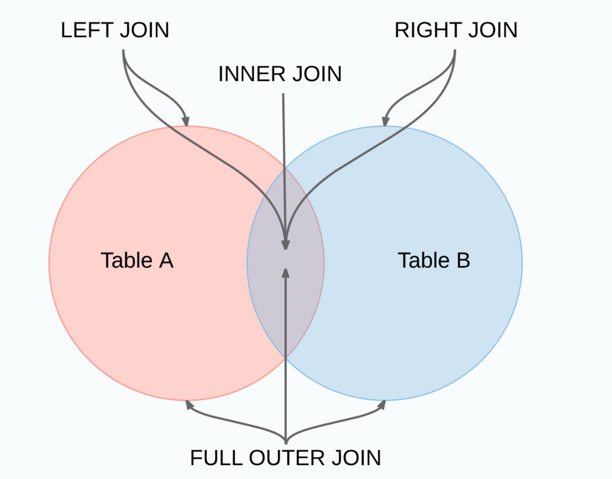
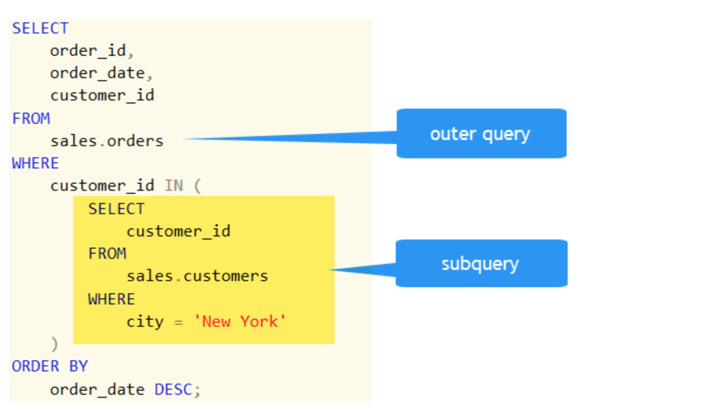
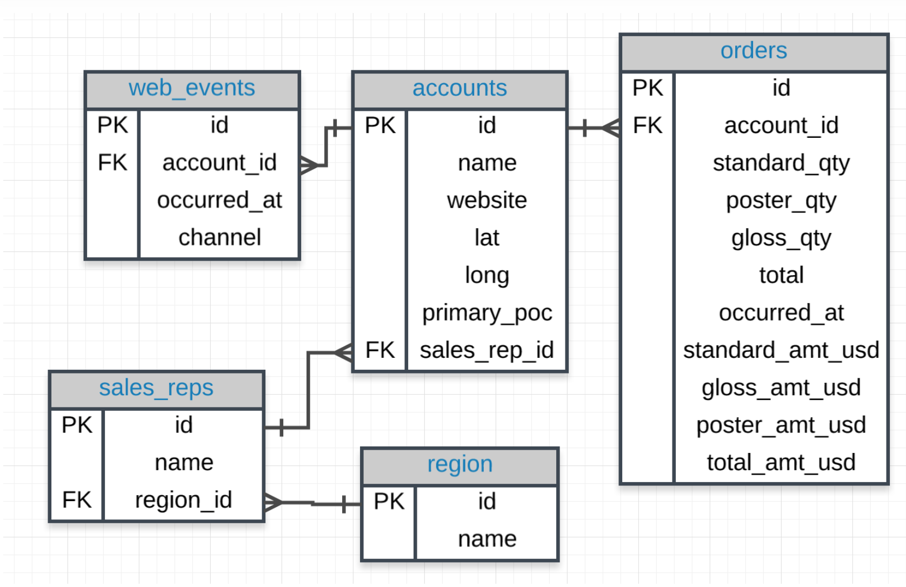

# SQL Interview Question Summary


#### Table Content:

1. [Fact Table and Dimension Table](#fact-table-and-dimension-table)
2. [Normalized vs Denormalized](#normalized-vs-denormalized)
3. [Star Schema vs Snowflake Schema](#star-schema-vs-snowflake-schema)
4. [OLTP vs OLAP](#oltp-vs-olap)
5. [Left Join vs Right Join, Inner Join vs Outer Join](#left-join-vs-right-join,-inner-join-vs-outer-join)
6. [What is `Correlated Subquery`?](#what-is-`correlated-subquery`)
7. [EXISTS vs. IN](#exists-vs.-in)
8. [TRUNCATE vs. DELETE vs. DROP](#truncate-vs.-delete-vs.-drop)
9. [Dimensional model](#dimensional-model)
10. [What's Inline Query?](#what's-inline-query)
11. [What-is-a-View?](#what-is-a-view)
12. [What are the various forms of Normalization?](#what-are-the-various-forms-of-normalization)

#### Fact Table and Dimension Table
---

#### Normalized vs Denormalized
---
- `Normalization` is the technique of dividing the data into multiple tables to reduce data redundancy and inconsistency and to achieve data integrity. `Denormalization` is the technique of combining the data into a single table to make data retrieval faster.

- `Normalization` is used in `OLTP` system, which emphasizes on making the insert, delete and update anomalies faster. `Denormalization` is used in `OLAP` system, which emphasizes on making the search and analysis faster.
- Data integrity is maintained in normalization process while in denormalization data integrity harder to retain.
- Redundant data is eliminated when normalization is performed whereas denormalization increases the redundant data.
- Normalization increases the number of tables and joins. In contrast, denormalization reduces the number of tables and join.
- Disk space is wasted in denormalization because same data is stored in different places. On the contrary, disk space is optimized in a normalized table.

#### Star Schema vs Snowflake Schema
---


#### OLTP vs OLAP
---

- `OLTP` stands for **Online Transaction Processing**, is a class of software applications capable of supporting transaction-oriented programs. An important attribute of an `OLTP` system is its ability to maintain concurrency. `OLTP` systems often follow a decentralized architecture to avoid single points of failure. These systems are generally designed for a large audience of end-users who conduct short transactions. Queries involved in such databases are generally simple, need fast response times and return relatively few records. A number of transactions per second acts as an effective measure for such systems.

- `OLAP` stands for **Online Analytical Processing**, a class of software programs which are characterized by the relatively low frequency of online transactions. Queries are often too complex and involve a bunch of aggregations. For `OLAP` systems, the effectiveness measure relies highly on response time. Such systems are widely used for data mining or maintaining aggregated, historical data, usually in **multi-dimensional** schemas.

#### Primary and Foreign Keys
- `primary keys` - are unique for every row in a table. These are generally the first column in our database.
> A table in SQL is indexed by default based on its primary key.

- `foreign keys` - are the primary key appearing in another table, which allows the rows to be non-unique.
> Foreign Key is automatically created when two tables are joined.


#### Left Join vs Right join, Inner join vs Outer join
---


An SQL Join statement is used to combine data or rows from two or more tables based on a common field between them. Different types of Joins are:
- `INNER JOIN`: The `INNER JOIN` keyword selects all rows from both the tables as long as the condition satisfies. This keyword will create the result-set by combining all rows from both the tables where the condition satisfies i.e value of the common field will be same.

- `LEFT JOIN`:This join returns all the rows of the table on the left side of the join and matching rows for the table on the right side of join. The rows for which there is no matching row on right side, the result-set will contain null. `LEFT JOIN` is also known as `LEFT OUTER JOIN`

- `RIGHT JOIN`:`RIGHT JOIN` is similar to `LEFT JOIN`. This join returns all the rows of the table on the right side of the join and matching rows for the table on the left side of join. The rows for which there is no matching row on left side, the result-set will contain null. `RIGHT JOIN` is also known as `RIGHT OUTER{:height="36px" width="36px"}. JOIN`.

- `FULL JOIN`: `FULL JOIN` The result-set will contain all the rows from both the tables. The rows for which there is no matching, the result-set will contain NULL values.

#### What is `Correlated Subquery`?

{:height="36px" width="36px"}.

```
SELECT
    customer_id,
    first_name,
    last_name,
    city
FROM
    sales.customers c
WHERE
    NOT EXISTS (
        SELECT
            customer_id
        FROM
            sales.orders o
        WHERE
            o.customer_id = c.customer_id
        AND YEAR (order_date) = 2017
    )
ORDER BY
    first_name,
    last_name;

```


`Correlated subqueries` are used for row-by-row processing


#### EXISTS vs. IN, if condition returned as NULL

- `EXISTS` is much faster than `IN`, when the sub-query results is very large.
- `IN` is faster than `EXISTS`, when the sub-query results is very small.
- Also, the `IN` clause can't compare anything with NULL values, but the `EXISTS` clause can compare everything with NULLs.

```
SELECT
    column_1
FROM
    table_1
    WHERE
    EXISTS( SELECT
                1
            FROM
                table_2
            WHERE
                column_2 = table_1.column_1);
```
> Note that if the subquery returns NULL, the result of EXISTS is true.


#### TRUNCATE vs. DELETE vs. DROP
- `DELETE` statement is used to delete rows from a table.
```
DELETE FROM Candidates
WHERE CandidateId > 1000;
```

- `TRUNCATE` command is used to delete all the rows from the table and free the space containing the table.
```
TRUNCATE TABLE Candidates;
```
> An SQL query to delete a table from the database and memory while keeping the structure of the table intact

- `DROP` command is used to remove an object from the database. If you drop a table, all the rows in the table is deleted and the table structure is removed from the database.
```
DROP TABLE Candidates;
```
> **What is the difference between DROP and TRUNCATE statements?<br>**
> If a table is dropped, all things associated with the tables are dropped as well. This includes - the relationships defined on the table with other tables, the integrity checks and constraints, access privileges and other grants that the table has. To create and use the table again in its original form, all these relations, checks, constraints, privileges and relationships need to be redefined. However, if a table is truncated, none of the above problems exist and the table retains its original structure.<br>
> **What is the difference between DELETE and TRUNCATE statements?**<br>
> The TRUNCATE command is used to delete all the rows from the table and free the space containing the table.
The DELETE command deletes only the rows from the table based on the condition given in the where clause or deletes all the rows from the table if no condition is specified. But it does not free the space containing the table.

#### Dimensional model


#### What's Inline Query

`Inline Query`: A subquery can also be found in the FROM clause. These are called inline views.

An `INLINE` view is subquery with an alias(or correlation name) that you can use within a SQL statement. An inline view is not a schema. An inline view is placing a subquery in the `FROM` clause and giving that subquery an alias.

```
SELECT * FROM (SELECT id, name FROM users)
```

#### What is a View?

A `view` in SQL is a `virtual table` based on the result-set of an SQL statement. A view contains rows and columns, just like a real table. The fields in a view are fields from one or more real tables in the database.


#### What are the various forms of Normalization?



